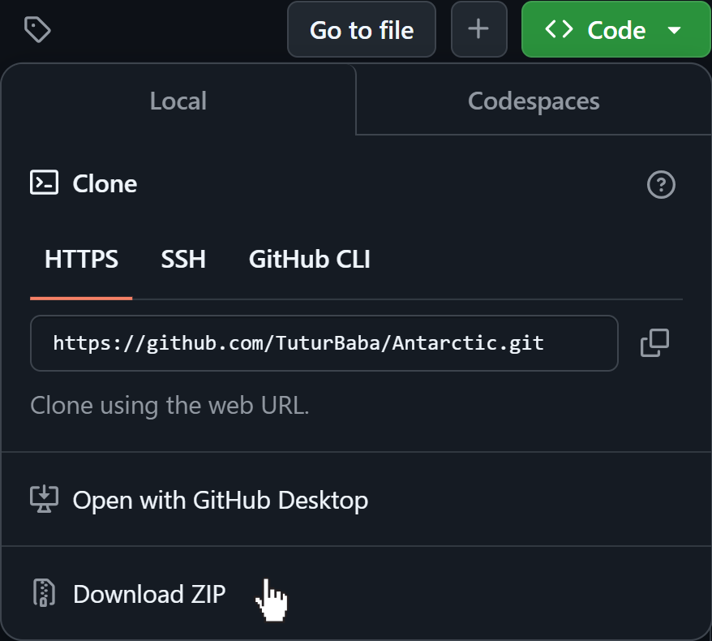
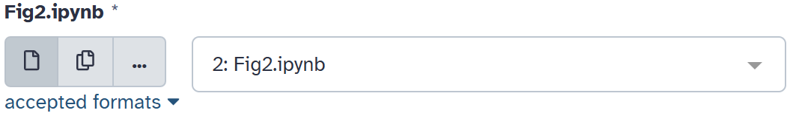
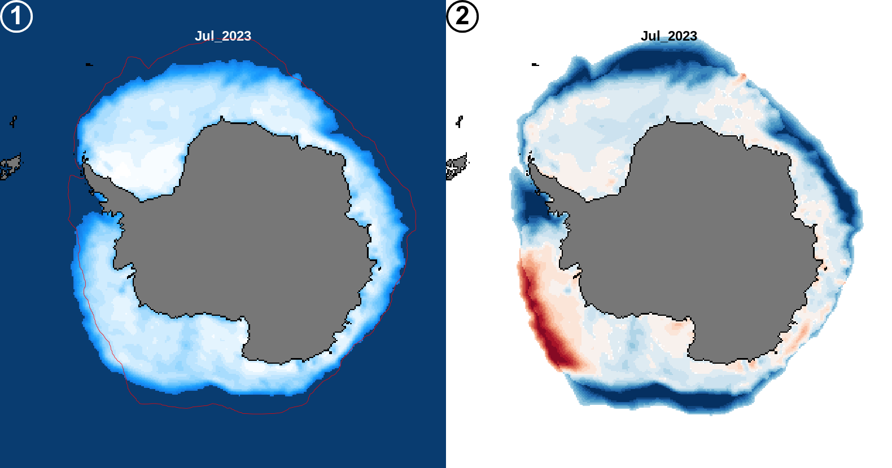

# README 

## Auteur
Arthur BARREAU - 06 Février 2025

Ce repot Git est dans le cadre de la creation d'un Worflow pour fabriquer un certains nombre de figure dans le cadre d'un article sur l'etat de le l'environnement marine au sein de air de l'Antarctique. Les differents script est initialmeent prevu pour tourner sur [Galaxy Europe](https://usegalaxy.eu/), sur un ce worflow: [https://usegalaxy.eu/u/arthurb/w/worflow-for-representig-state-of-the-environment-in-antarctic](https://usegalaxy.eu/u/arthurb/w/worflow-for-representig-state-of-the-environment-in-antarctic)

## Sommaire  
- [Tuto utilisation](#tuto-utilisation)  
- [Figure 3](#fig3)  
- [Prérequis](#prérequis)  
- [Entrée](#entrée)  
- [Utilisation (sans Galaxy)](#utilisation-sans-galaxy)  
- [Problèmes connus](#problèmes-connus)   


## Tuto utilisation

### Téléchargement des fichiers

Sur GitHub, téléchargez l’ensemble des fichiers en ZIP :  


### Importation des fichiers sur Galaxy

1. Sur Galaxy, cliquez sur **Run** en haut à droite.
2. Cliquez sur le logo **Upload** à gauche.
3. Appuyez sur **Choose local file** et sélectionnez l’ensemble des fichiers du dossier "script".
4. Cliquez sur **Start**, puis, une fois que tout est vert, cliquez sur **Close**.
5. Attendez que tous les fichiers apparaissent en vert dans l’historique à droite.
6. Sélectionnez les noms des dossiers correspondants pour chaque figure.  
   

### Exécution du workflow

1. Modifiez les variables si nécessaire.
2. Cliquez sur **Run Workflow** en haut à droite.
3. Le workflow est maintenant lancé. Il ne reste plus qu'à patienter et, une fois terminé, télécharger les différentes figures depuis l’historique.


## Fig3



Le script R de la Figure 3 télécharge, traite et visualise les données sur la concentration de glace de mer en Antarctique. Deux visualisations sont possibles : la concentration de glace pour un mois précis et les anomalies par rapport à la période de référence 1981-2010. Les données proviennent de la NSIDC (National Snow and Ice Data Center) et sont disponibles ici : [https://noaadata.apps.nsidc.org/NOAA/G02135/](https://noaadata.apps.nsidc.org/NOAA/G02135/).

### Prérequis
Le script étant un notebook Jupyter (`.ipynb`), il a été conçu pour être utilisé via Galaxy Notebook. L'utilisation la plus simple consiste à utiliser le workflow adapté décrit plus haut.

Sans l'utilisation de Galaxy, le script fonctionne sur un kernel R. Les bibliothèques suivantes doivent être installées :  

- `terra`
- `dplyr`
- `stringr`
- `RColorBrewer`
- `sf`
- `jsonlite`

### Entrée
Si vous utilisez Galaxy, des valeurs par défaut sont fournies pour chaque paramètre, accompagnées d'un descriptif.

Sinon, les paramètres d'entrée doivent être fournis sous forme d'un fichier JSON avec la structure suivante :
```json
{
    "month": "Jan,Feb",
    "year": "2023,2024",
    "ConcentrationXandXorXAnomalies": "Concentration_Anomalies"
}
```
Pour "month" et "year", les valeurs doivent être séparées par une virgule sans espace. Pour "Concentration and or Anomalies", le séparateur est un tiret du 8 (`_`).

Le nombre d'entrées pour "month" et "year" doit être identique, avec un minimum d'une valeur et sans maximum. Vous avez l'exemple sur l'image du dessus, le numéro 1 est pour visualiser la `Concentration`, et le numéro 2 pour `Anomalies`. Sinon, `Concentration_Anomalies` permet d'afficher les deux visualisations.

### Utilisation (sans Galaxy)
1. Assurez-vous que le fichier JSON est correctement rempli et que le chemin à la ligne 178 est correct.
2. Exécutez le script dans un environnement R.
3. Les sorties seront générées dans le dossier `outputs/` sous forme d'image PNG.

### Problèmes connus
- Si l'année 1978 est sélectionnée, certains fichiers peuvent être manquants.
- L'utilisation hors Galaxy n'a pas été testée.


